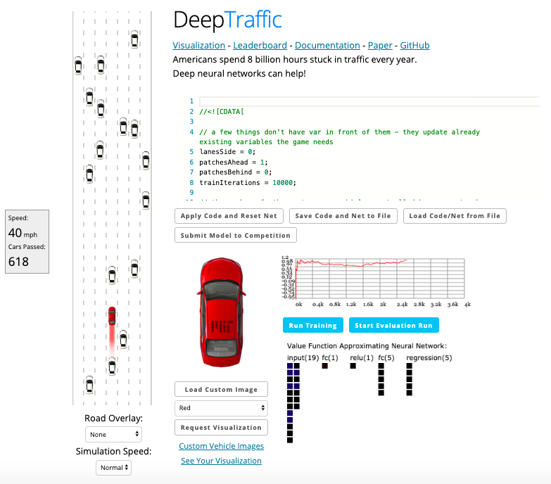

# DeepTraffic

In DeepTraffic, users are allow to create their neural net- works in JavaScript to train the target vehicle, displayed as the red car in below figure. The number of the target vehicles can be more than one. The other vehicles are controlled by the traffic simulation system with some hyperparameters open for users to modify. The implementation of this simulator uses APIs from ConvNetJS.

There are several hyperparameters and can be categorized into:
1. Vehicle's vision
2. Number of training iterations
3. Number of neurons
4. Activation functions

Eventually, I let the vehicle sees its three lanes: left, right, and the lane it is on. I established four layers of neurons with _tanh_ activation functions with training iterations set to a hundred thousand times. The results ended up to reach 70 mph.
